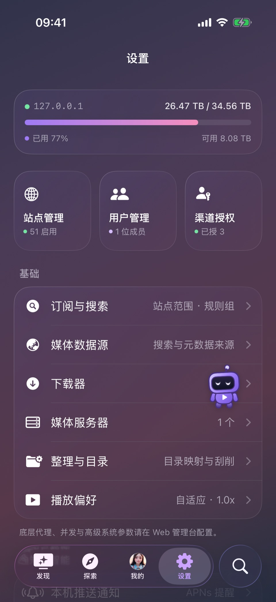
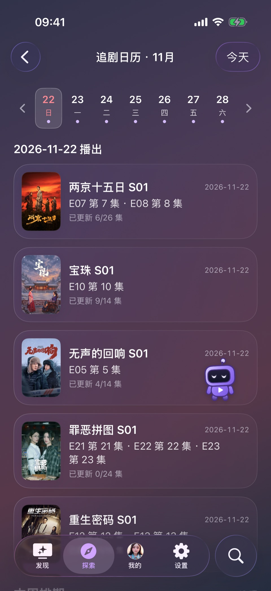
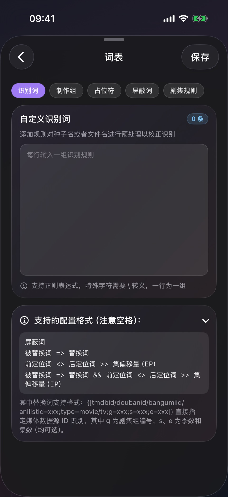
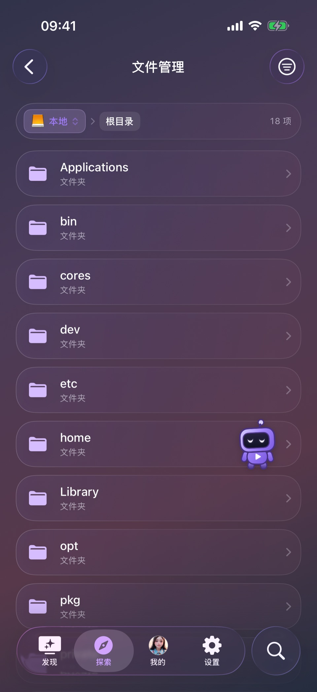
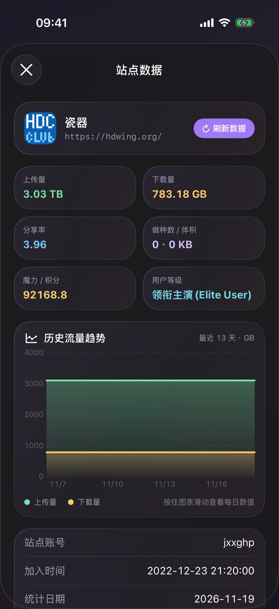
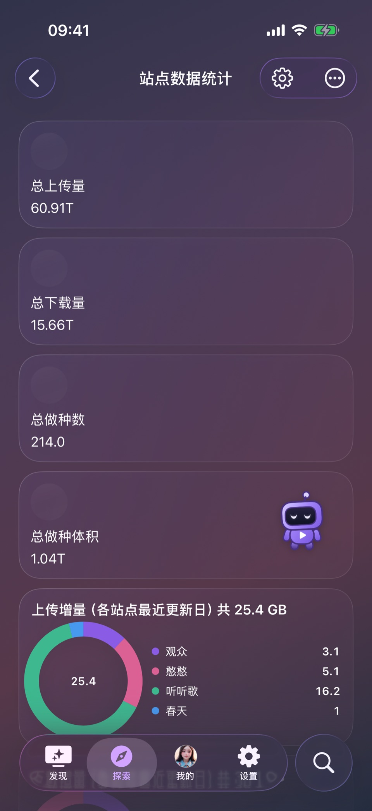

# MoviePilot-App v2 界面图册

以下全部 60 张截图采集自 iPhone 17（iOS 26 模拟器）真实运行界面，展示全原生 SwiftUI v2 客户端（零主流程 WebView）的 4+1 Liquid Glass 导航、玻璃弹层、原生图表与完整业务交互。

特别说明：UI设计风格参考了 [Rex iOS App](https://rexnow.tv)。

## 连接服务与登录

| 连接服务 | 已保存服务与连接按钮 | 登录 |
| :---: | :---: | :---: |
|  |  |  |

## 4+1 底部导航、弹出菜单与设置中心

| 发现（透明片名 Logo） | 探索 | 我的（仪表盘） |
| :---: | :---: | :---: |
|  |  |  |

| 设置主中心 | 重复点击底栏弹出菜单 | 全局搜索（+1 默认回退） |
| :---: | :---: | :---: |
|  |  |  |

## 发现滚动、模块编排、详情与人物

| 发现滚动阶段 2 | 发现滚动阶段 3 | 发现滚动阶段 4 |
| :---: | :---: | :---: |
|  |  |  |

| 发现模块编辑（独立媒体库/分类浏览） | 榜单网格（分页前） | 榜单网格（自动翻页） |
| :---: | :---: | :---: |
|  |  |  |

| 媒体详情（订阅 + 搜索资源） | 媒体详情演职员 | 人物详情 |
| :---: | :---: | :---: |
|  |  |  |

| 剧集详情 | 剧集分季 | 网格翻页状态 |
| :---: | :---: | :---: |
|  |  |  |

## 探索、豆瓣详情、音乐、订阅与资源下载

| 探索（豆瓣筛选） | 豆瓣作品详情 | 豆瓣演职员与推荐 |
| :---: | :---: | :---: |
|  |  |  |

| 音乐发现 | 音乐专辑与曲目播放 | 站点资源（关键词搜索 / 首页浏览） |
| :---: | :---: | :---: |
|  |  |  |

| 我的订阅 | 订阅规则编辑 | 追剧日历 |
| :---: | :---: | :---: |
|  |  |  |

| 订阅广场（热门订阅） | 订阅广场（社区分享） | 正在下载 |
| :---: | :---: | :---: |
|  |  |  |

## 消息、智能助手与捷径诊断中心

| 消息中心（玻璃弹层） | 智能助手（SSE 流式对话） | 捷径菜单（玻璃弹层） |
| :---: | :---: | :---: |
|  |  |  |

| 捷径：词表与语法说明 | 捷径：定时服务 | 捷径：实时日志 |
| :---: | :---: | :---: |
|  |  |  |

## 整理历史、队列、文件管理与工作流

| 整理历史（相对时间 + 链式路径） | 整理队列弹窗 | 文件管理（长按删除 + 动态 +1 按钮） |
| :---: | :---: | :---: |
|  |  |  |

| 工作流列表 | 纯原生工作流节点画布 | 工作流社区分享 |
| :---: | :---: | :---: |
|  |  |  |

## 站点、系统配置与外观

| 站点管理（上下行流量图示） | 站点数据（历史流量趋势图） | 订阅与搜索设置 |
| :---: | :---: | :---: |
|  |  |  |

| 媒体数据源配置 | 下载器管理 | 媒体服务器管理 |
| :---: | :---: | :---: |
|  |  |  |

| 目录与存储 | 服务端通知渠道 | 主题与外观 |
| :---: | :---: | :---: |
|  |  |  |

## 用户管理与插件生态

| 用户管理 | 插件市场 | 已安装插件管理 |
| :---: | :---: | :---: |
|  |  |  |

| 仪表盘无缝插件图表 | 插件数据页（站点统计环形图） | 插件数据页（猫眼票房排行） |
| :---: | :---: | :---: |
|  |  |  |

